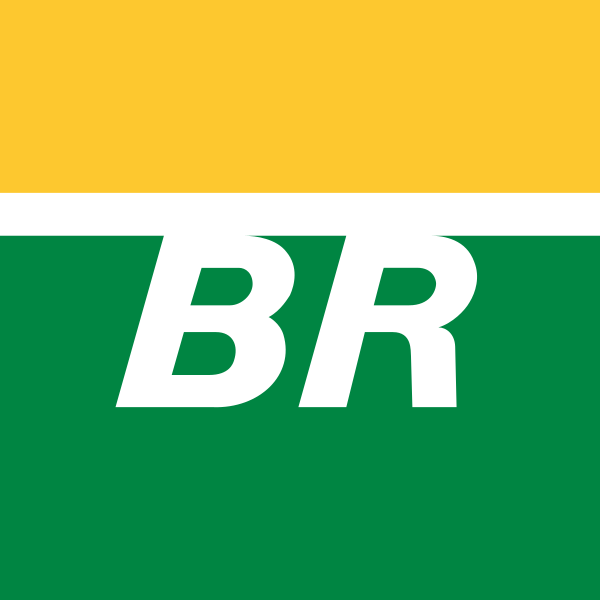

# Introdução a Linguagem de Marcação (MD)
## 2° Semestre 2026 - Dev A
### Início com MarkDown

Vamos começar falando sobre hierarquia e estilo simples

Exemplos de uso de estilização em negrito **Palavra** utiliza-se **

Em itálico *Palavra* utiliza-se *

Em tachado ~~Palavra~~ utiliza-se ~~

# Lista de Compras

- Arroz
- Feijão
- Mandioca
- Abacate
  - Verde
 
Acesse o [Google](www.google.com.br)


Exemplo de trecho de código:

```Javascript
function saudação(nome){
  console.log(`Oi senhor(a) ${nome}!`);
}
```
## Exemplo Tabela

| Recurso | Suporte | Status |
| :--- | :--- | :--- | 
| HTML | Sim | Ativo |
| MD | Sim | Ativo |


